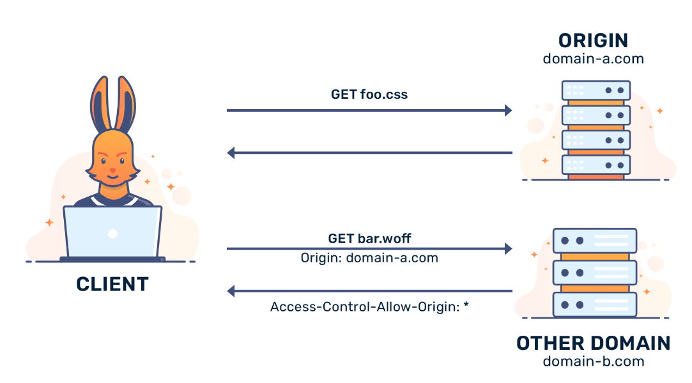

# Simple example on how to enable CORS globally(whole project) and locally(method, class)
Source: https://spring.io/guides/gs/rest-service-cors

-         What causes CORS issues?
          CORS errors happen when a webpage makes a request to a different domain than the one that served the page, 
          and the server responds with an HTTP error because the “Origin” header in the request is not allowed by the
          server's CORS configuration.

